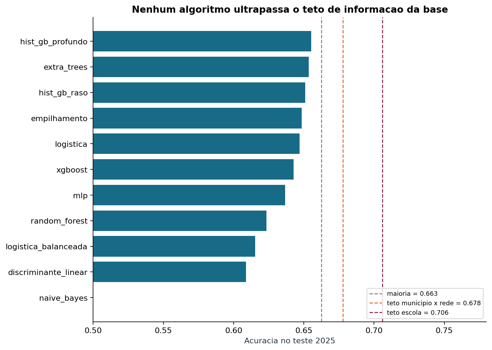
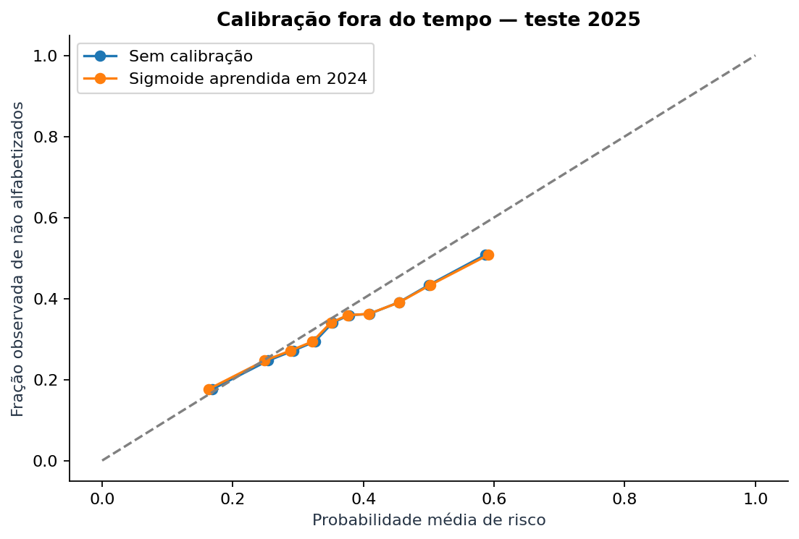
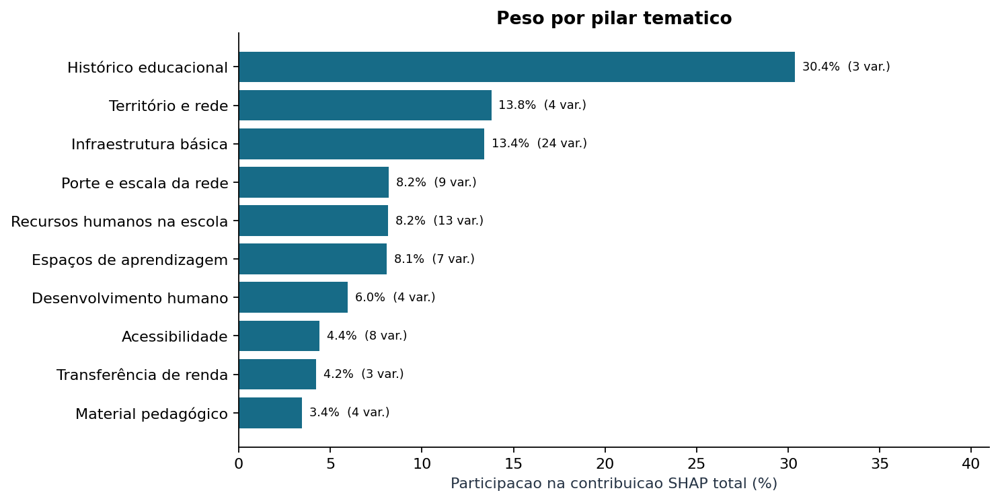
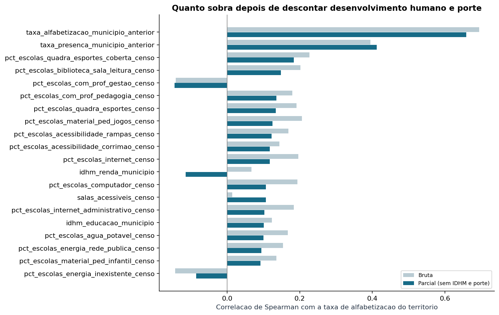
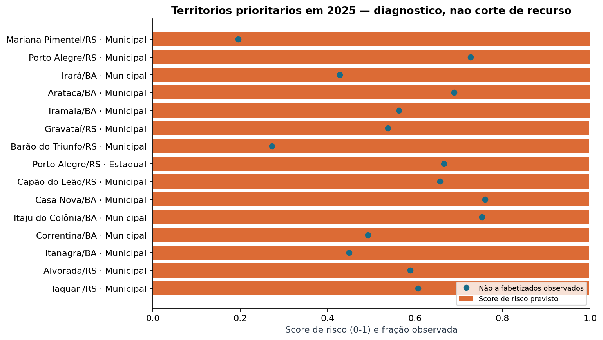

# Tech Challenge FIAP — Fase 3

## Predição e Inteligência Analítica para Alfabetização no Brasil

Classificação supervisionada sobre a camada Gold construída na Fase 2, com
pipeline scikit-learn de ponta a ponta, teste fora do tempo (desenvolve em 2024,
testa em 2025), interpretabilidade por SHAP e permutação, e priorização
territorial para uso em política pública.

O projeto entrega **dois modelos**, porque a medição mostrou que um só não
resolve o problema:

| | Unidade | Pergunta | Resultado no teste de 2025 |
|---|---|---|---|
| **Modelo por aluno** | avaliação individual | esta criança será alfabetizada? | ROC AUC 0,6276 · F1 macro 0,5668 · **acurácia 0,6489, abaixo do baseline 0,6626** |
| **Modelo territorial** | município × rede | este território está entre os piores? | **acurácia 0,7398** · ROC AUC 0,8198 · precisão 88% no top-25 |

A razão está medida na seção [Interpretação dos resultados](#interpretação-dos-resultados):
todos os 79 preditores do contrato são medidos em município ou município × rede,
então no nível da criança a base contém menos informação do que a acurácia
desejada exigiria. Reconhecer esse teto e mudar a unidade de análise é o
principal resultado técnico do projeto.

```powershell
python -m venv .venv
.venv\Scripts\Activate.ps1
pip install -r requirements.txt
python -m pytest tests/ -q          # 30 testes de contrato e invariantes
python main.py temporal    --execution-date 2026-09-08   # modelo por aluno
python main.py diagnostico --execution-date 2026-09-08   # teto, território, insights
```

Relatórios gerados: [diagnóstico e insights](reports/diagnostico_e_insights.md) ·
[resultados temporais](reports/resultados_temporais.md) ·
[decisões analíticas](reports/decisoes_analiticas.md) ·
[protocolo temporal](reports/protocolo_temporal.md) ·
[aplicação estratégica](reports/aplicacao_estrategica.md).
Notebooks: [análise por aluno](notebooks/01_analise_alfabetizacao.ipynb) ·
[validação temporal](notebooks/02_enriquecimento_validacao_temporal.ipynb).

---

## Contexto do problema

O **Compromisso Nacional Criança Alfabetizada** mobiliza União, estados, DF e
municípios para garantir que toda criança esteja alfabetizada ao final do 2º ano
do Ensino Fundamental. A Pesquisa Alfabetiza Brasil (INEP, 2023) fixou o corte de
**743 pontos na escala de proficiência do Saeb** como o patamar de alfabetização,
e desse parâmetro nasce o **Indicador Criança Alfabetizada**: o percentual de
estudantes que atingem esse nível. A meta nacional é 100% até 2030.

Acompanhar o indicador depois do fato não basta para decidir. Um gestor precisa
saber, antes de alocar orçamento, **onde o risco está concentrado** e **quais
fatores se movem junto com o resultado**. É esse salto — de dado publicado para
inteligência aplicada — que este projeto executa sobre a fundação de engenharia
de dados construída na Fase 2.

A Fase 2 integrou sete entidades públicas do INEP e do Cadastro Único em
arquitetura medalhão (Bronze → Silver → Gold), com ingestão híbrida batch e
streaming, gate de qualidade por safra e materialização em tabelas analíticas.
A Fase 3 consome **exclusivamente a camada Gold** dessa pipeline: não há leitura
de Silver ou Bronze, nem importação do código da Fase 2.

## Objetivo analítico

Prever o rótulo `alfabetizado_binario`, onde **1 = alfabetizado** e
**0 = não alfabetizado**. A classe de interesse operacional é a **0**: é o aluno
que o sistema precisa encontrar. Probabilidades, recall e precisão de risco
seguem essa orientação.

O experimento é **retrospectivo e territorial**. O modelo por aluno responde
"qual a probabilidade de risco dado o contexto do território e da rede", não
"o que acontecerá com esta criança". Nenhum atributo descreve a trajetória, a
família ou a sala de aula do estudante, e nenhum resultado aqui autoriza
classificar uma criança individualmente.

O modelo territorial formaliza a pergunta que o dado consegue responder:
`risco_territorial` = 1 quando a taxa de alfabetização do município × rede fica
**abaixo da mediana nacional da própria edição**. As classes ficam equilibradas
por construção, então a referência de acaso é 50%.

## Descrição da base utilizada

Fonte única: `gold.base_modelagem_aluno_enriquecida`, execução `2026-09-08`,
lida de `data/lake` dentro deste repositório. A leitura confere o SHA-256 de cada
arquivo contra `manifesto_enriquecimento.json` e aborta se algum divergir.

| Edição | Registros Gold | Avaliações elegíveis | Taxa de alfabetização | Escolas | Municípios | UFs | Cobertura do histórico |
|---|---:|---:|---:|---:|---:|---:|---:|
| 2023 | 1.747.439 | 1.502.809 | 0,5839 | 36.776 | 4.873 | 23 | — |
| 2024 | 2.120.560 | 1.851.852 | 0,5978 | 42.497 | 5.519 | 26 | 77,2% |
| 2025 | 2.222.164 | 1.966.095 | 0,6626 | 43.644 | 5.556 | 27 | 99,2% |

Em 2024, 267.772 registros são de alunos **ausentes** e 936 de presentes **sem
proficiência válida**: ficam fora do alvo, não viram classe. A rede Municipal
responde por 1.840.277 registros, a Estadual por 280.258 e a Privada por 25.
Bolsa Família, população IBGE, Censo Escolar e IDHM cobrem 100% das avaliações
de 2024 e 2025.

### Os 79 preditores

Todos derivam do contrato Gold e são medidos **no ano anterior ou antes**, nunca
de forma contemporânea à avaliação. A lista completa está em
[src/config.py](src/config.py) e [src/preprocessing/enriquecida.py](src/preprocessing/enriquecida.py).

| Pilar | Variáveis | Conteúdo | Origem |
|---|---:|---|---|
| Infraestrutura básica | 24 | água, esgoto, energia, internet, computador, salas climatizadas e acessíveis | Censo Escolar |
| Recursos humanos na escola | 13 | presença de pedagogo, psicólogo, coordenador, bibliotecário, nutricionista, assistente social | Censo Escolar |
| Porte e escala da rede | 9 | população, escolas, matrículas, turmas, docentes, salas, matrículas por turma e por docente | IBGE + Censo Escolar |
| Acessibilidade | 8 | rampas, corrimão, elevador, pisos táteis, sinalização sonora/tátil/visual | Censo Escolar |
| Espaços de aprendizagem | 7 | biblioteca, sala de leitura, quadra coberta e descoberta, laboratório de informática | Censo Escolar |
| Desenvolvimento humano | 4 | IDHM geral, educação, longevidade e renda | Atlas do Desenvolvimento Humano |
| Material pedagógico | 4 | multimídia, infantil, científico, jogos | Censo Escolar |
| Território e rede | 4 | rede, UF, região, percentual de escolas rurais | Gold + Censo Escolar |
| Histórico educacional | 3 | taxa de alfabetização, taxa de presença e volume de avaliações do município no ano anterior | Indicador Criança Alfabetizada |
| Transferência de renda | 3 | quantidade, valor total e valor médio de pagamentos Bolsa Família | Cadastro Único |

Referência temporal de cada fonte, por edição avaliada:

| Avaliação | População IBGE | Censo Escolar | Histórico e Bolsa Família |
|---|---|---|---|
| 2024 | Censo Demográfico 2022 | 2023 | 2023 |
| 2025 | Estimativa 2024 | 2024 | 2024 |

### Variáveis deliberadamente excluídas

Cada exclusão está codificada no dicionário `PROIBIDAS` em
[src/config.py](src/config.py), e um teste falha se alguma reaparecer:

| Variável | Motivo |
|---|---|
| `proficiencia` | define o próprio alvo pelo corte de 743 pontos |
| `presenca` | é critério de elegibilidade, conhecido só depois da prova |
| `elegivel_modelagem`, `motivo_exclusao_modelagem` | derivam da existência e validade da avaliação |
| `meta_alfabetizacao_*`, `status_meta`, `distancia_meta` | data de publicação e revisões anteriores à previsão não foram comprovadas |
| `taxa_alfabetizacao_escola_anterior` | códigos escolares não têm correspondência longitudinal validada |
| `peso_aluno` | disponibilidade prévia não validada |

As metas municipais e estaduais permanecem no repositório como **contexto de
negócio** — usadas na seção de aplicação estratégica para medir distância até o
alvo, nunca como preditor.

## Etapas de modelagem

### 1. Validação de contrato e proveniência

`src/preprocessing/` valida o esquema, a unicidade da chave
`ano + município + escola + aluno + série + rede`, o domínio do alvo, a
coerência dos marcadores de cobertura e — no bloco enriquecido — que **nenhuma
referência temporal seja contemporânea ou futura** em relação à avaliação. Cada
arquivo tem SHA-256 conferido contra o manifesto e registrado no relatório.

### 2. Tratamento de data leakage

Três barreiras, em camadas independentes:

- **Vazamento de alvo:** o contrato `PROIBIDAS` bloqueia toda variável derivada
  do resultado contemporâneo; o teste `test_contrato_gold.py` falha se alguma
  entrar na lista de preditores.
- **Vazamento temporal:** toda medida vem de ano anterior, verificado por
  asserção sobre as colunas `ano_referencia_*`. O teste final é a edição de
  **2025 inteira**, aberta só depois que o modelo foi congelado em disco com
  hash e carimbo de tempo em `reports/selecao_temporal_antes_teste.json`.
- **Vazamento de grupo:** a divisão é por **escola** (modelo por aluno) e por
  **município** (modelo territorial), nunca por linha. Alunos da mesma escola não
  se espalham entre treino e teste. Uma asserção aborta a execução se houver
  interseção de grupos entre partições ou entre dobras da validação cruzada.

### 3. Pré-processamento integrado ao modelo

Nada é aprendido antes da divisão. Todo o tratamento vive dentro de um
`Pipeline` + `ColumnTransformer` e é reajustado em cada dobra
([src/modeling/pipelines.py](src/modeling/pipelines.py)):

| Etapa | Aplicação |
|---|---|
| Imputação numérica | mediana, com `add_indicator` — a própria ausência vira variável |
| Transformação de assimetria | `log1p` em volumes e valores (população, matrículas, pagamentos) |
| Padronização | `StandardScaler` em todas as numéricas |
| Imputação categórica | categoria explícita `"Ausente"` |
| Encoding categórico | `OneHotEncoder(handle_unknown="ignore")` — UF nova no teste não quebra a inferência |

Como o transformador é um passo do pipeline, a busca de hiperparâmetros, a
validação cruzada e o `joblib` serializado carregam o pré-processamento junto:
não existe caminho em que o modelo veja dados tratados por estatística do teste.

### 4. Divisão e busca

| Modelo | Desenvolvimento | Teste | Agrupamento |
|---|---|---|---|
| Por aluno | 2024, 60/20/20 por escola | edição 2025 completa | escola |
| Territorial | 2024, 75/25 por município | edição 2025 completa | município |

A busca de hiperparâmetros roda em `StratifiedGroupKFold` / `GroupKFold` dentro
do treino. A seleção usa **apenas a validação**, é gravada em disco antes de o
teste ser aberto, e o vencedor é reajustado em treino + validação.

### 5. Colapso exato para o benchmark amplo

Os 79 preditores são constantes dentro de município × rede: as 1.851.852
avaliações de 2024 assumem **6.536 valores distintos de X**. O módulo
[src/preprocessing/unidades.py](src/preprocessing/unidades.py) colapsa a base
nessas unidades, com peso `(n_não_alfabetizados, n_alfabetizados)`, e uma
asserção falha se algum preditor variar dentro da unidade. As métricas
ponderadas reproduzem exatamente as métricas por avaliação — há teste para isso —
e o que era um ajuste em 1,85 milhão de linhas vira um ajuste em 13 mil. Foi o
que permitiu comparar doze famílias de algoritmos com busca de hiperparâmetros
em minutos em vez de horas.

### 6. Calibração e interpretabilidade

A calibração sigmoide do modelo por aluno é aprendida em 20% de escolas do
desenvolvimento **reservadas**, com `FrozenEstimator`, de modo que o estimador
não é reajustado. SHAP e permutação rodam sobre o modelo já congelado, e a
reconstrução da probabilidade a partir das contribuições SHAP é validada
numericamente (erro máximo 7,2 × 10⁻⁷) — se não fechasse, a execução abortaria.

## Escolha do algoritmo

O critério é declarado antes de ver o teste e gravado em
`reports/runs/<run_id>/selecao_antes_teste.json`.

**Modelo por aluno.** Doze candidatos: baseline de classe majoritária, regressão
logística (simples e com pesos de classe), discriminante linear, naive Bayes,
random forest, extra trees, dois gradient boostings, XGBoost, rede neural MLP e
empilhamento de quatro famílias. Critério: maior F1 macro na validação de
municípios disjuntos; o limiar de maior acurácia também é escolhido na validação.

A regressão logística com pesos de classe venceu por F1 macro; extra trees venceu
por acurácia. A elasticnet foi retirada do catálogo por motivo documentado: o
`saga` é o único solver que a implementa e não converge em 10.000 iterações nas
dobras da validação cruzada, porque colunas do Censo quase constantes dentro de
uma dobra ficam mal condicionadas após a padronização. Um ajuste interrompido não
seria comparável aos demais.

**Modelo territorial.** Os mesmos candidatos, com dois blocos de preditores:
`completo` (79) e `estrutural` (76, sem as três variáveis de histórico de
alfabetização). Critério: maior acurácia na validação sob a regra de posto.

Duas regras de decisão são reportadas. A **regra de posto** marca a metade de
menor score, usando só a ordenação prevista e a definição do alvo. Ela absorve o
deslocamento de nível entre edições — a mediana nacional subiu de 0,6192 em 2024
para 0,7079 em 2025 — que penaliza modelos lineares calibrados na escala do ano
de treino.

## Métricas de avaliação

### Teto de informação da base

Antes de comparar algoritmos, mediu-se o que a base permite. Um oráculo que
soubesse a taxa **verdadeira** de cada grupo no próprio ano de teste chegaria a:

| Oráculo (limite superior) | Grupos | Acurácia máxima em 2025 |
|---|---:|---:|
| Prever sempre a classe majoritária | — | 0,6626 |
| Saber a taxa exata do **município** | 5.556 | 0,6764 |
| Saber a taxa exata de **município × rede** | 6.574 | 0,6779 |
| Saber a taxa exata da **escola** | 43.538 | 0,7059 |

### Modelo por aluno — benchmark de 11 algoritmos (2024 → 2025)

| Modelo | Acurácia validação | Acurácia teste | F1 macro teste | ROC AUC teste |
|---|---:|---:|---:|---:|
| **Classe majoritária** | 0,6117 | **0,6626** | 0,3985 | 0,5000 |
| hist_gb_profundo | 0,6434 | 0,6560 | 0,5588 | 0,6360 |
| extra_trees | 0,6476 | 0,6550 | 0,5613 | 0,6384 |
| hist_gb_raso | 0,6451 | 0,6539 | 0,5636 | 0,6380 |
| empilhamento | 0,6456 | 0,6497 | 0,5650 | 0,6291 |
| logistica | 0,6446 | 0,6480 | 0,5677 | 0,6266 |
| xgboost | 0,6066 | 0,6436 | 0,5662 | 0,6139 |
| mlp | 0,6443 | 0,6382 | 0,5742 | 0,6338 |
| random_forest | 0,6046 | 0,6314 | 0,5795 | 0,6253 |
| logistica_balanceada | 0,5969 | 0,6162 | 0,5823 | 0,6274 |
| discriminante_linear | 0,6443 | 0,6112 | 0,5852 | 0,6348 |
| naive_bayes | 0,5911 | 0,3886 | 0,3454 | 0,5965 |

O modelo formal da entrega, com calibração sigmoide e limiar 0,5, fecha em
**F1 macro 0,5668, ROC AUC 0,6276 e Brier 0,2182** na edição de 2025, com
acurácia 0,6489 — abaixo dos 0,6626 do baseline, pelo mesmo motivo que todos os
outros. O IC 95% de F1, por bootstrap de escolas com modelo fixo, é
**[0,5934; 0,6023]** no holdout por escola de 2024.

### Modelo territorial — 4.433 territórios em 2024, 4.547 em 2025

| Modelo | Validação (posto) | Teste (posto) | Teste (limiar 0,5) | ROC AUC | Teste sem histórico |
|---|---:|---:|---:|---:|---:|
| random_forest | 0,8179 | **0,7706** | 0,7678 | 0,8467 | 0,7491 |
| hist_gb_profundo | 0,8134 | 0,7702 | 0,7671 | 0,8452 | 0,7667 |
| extra_trees | 0,8207 | 0,7675 | 0,7631 | 0,8450 | 0,7799 |
| xgboost | 0,8207 | 0,7671 | 0,7614 | 0,8412 | 0,7398 |
| hist_gb_raso | 0,8152 | 0,7662 | 0,7636 | 0,8420 | 0,7161 |
| discriminante_linear | 0,8207 | 0,7636 | 0,7627 | 0,8426 | 0,7205 |
| empilhamento | 0,8098 | 0,7618 | 0,7583 | 0,7877 | 0,7636 |
| mlp | 0,7862 | 0,7530 | 0,7433 | 0,8127 | 0,7389 |
| **logistica** (selecionada) | 0,8225 | **0,7398** | 0,7337 | 0,8198 | 0,7231 |
| naive_bayes | 0,7663 | 0,6743 | 0,6719 | 0,7556 | 0,6642 |
| classe majoritária | 0,5127 | 0,4999 | 0,5001 | 0,5000 | 0,4999 |

O modelo congelado na validação foi a **logística**, com **acurácia 0,7398 e
ROC AUC 0,8198** no teste de 2025 — 24 pontos percentuais acima do acaso. O
random forest chegou a 0,7706 no teste, mas não foi escolhido: a seleção estava
congelada antes de 2025 ser aberto, e trocar o vencedor depois de ver o teste
invalidaria a estimativa. A diferença de 3 pontos é o preço honesto do protocolo.

Recortes do teste, sob o modelo selecionado:

| Dimensão | Grupo | Territórios | Acurácia | ROC AUC |
|---|---|---:|---:|---:|
| Rede | Municipal | 4.033 | 0,7424 | 0,8229 |
| Rede | Estadual | 514 | 0,7198 | 0,8029 |
| Região | Norte | 424 | 0,8019 | 0,8716 |
| Região | Sul | 922 | 0,7918 | 0,8613 |
| Região | Nordeste | 1.597 | 0,7689 | 0,8652 |
| Região | Centro-Oeste | 315 | 0,7460 | 0,8338 |
| Região | Sudeste | 1.289 | 0,6447 | 0,8289 |
| Município inédito em 2024 | sim | 222 | 0,7342 | 0,8066 |
| Município inédito em 2024 | não | 4.325 | 0,7401 | 0,8209 |

Dois pontos importam aqui. Municípios **nunca vistos** no treino perdem só 0,6
ponto de acurácia — o modelo generaliza para território novo, não memoriza. E o
Sudeste tem a menor acurácia com o segundo melhor AUC: a ordenação funciona lá,
o que falha é o corte, porque a distribuição regional é mais concentrada em torno
da mediana nacional.



## Interpretação dos resultados

### Por que a acurácia por aluno não passa de 66%

Os 79 preditores são medidos em município ou município × rede. Nenhum descreve a
criança. A consequência é exata, não retórica: **1.851.852 avaliações assumem
6.536 valores distintos de X**. Duas crianças da mesma rede recebem
obrigatoriamente a mesma probabilidade, e o tamanho amostral efetivo do modelo é
6.536, não 1,8 milhão.

Isso fixa um teto que nenhum algoritmo ultrapassa. **Nenhum dos onze modelos
aprendidos supera a classe majoritária em acurácia** — o melhor faz 0,6552 contra
0,6626 de não aprender nada. Eles ganham do baseline em F1 macro e ROC AUC porque
passam a encontrar não alfabetizados, e isso custa acurácia: a logística com
pesos de classe encontra 63,56% dos não alfabetizados com precisão de 50,23% no
holdout por escola de 2024, enquanto o baseline encontra zero. Para o gestor, um modelo que acha dois terços
do risco vale mais do que um que acerta 66% dizendo "está tudo bem".

O único candidato a desabar é o naive Bayes (0,3886): sua premissa de
independência condicional entre preditores altamente correlacionados — 24
indicadores de infraestrutura movem-se juntos — não sobrevive à mudança de
prevalência entre 2024 e 2025.

### Por que o território funciona

No agregado, o ruído binomial individual sai da métrica e o sinal contextual
aparece. O mesmo conjunto de variáveis que não distingue duas crianças separa
territórios com ROC AUC 0,8198. **A informação sempre esteve lá — na unidade
errada.**

### Calibração

Os pesos de classe deslocam a calibração: a logística superestima risco. A
sigmoide aprendida em escolas reservadas de 2024 reduz o Brier de 0,2329 para
0,2182 no teste de 2025, mas a calibração aprendida em uma edição degrada na
seguinte, porque a prevalência muda (40,4% de risco na validação de 2024, 33,7% no teste de 2025). O
score serve para **ordenar**, não como estimativa da taxa municipal.



## Insights encontrados

Três métodos independentes sobre a mesma unidade, para não depender de um só:
contribuição SHAP, queda de acurácia por permutação e associação direta com a
taxa observada — bruta e parcial, esta descontando IDHM e população.

### 1. O passado do território domina, e por larga margem

| Pilar | Variáveis | Participação no SHAP |
|---|---:|---:|
| Histórico educacional | 3 | 30,4% |
| Território e rede | 4 | 13,8% |
| Infraestrutura básica | 24 | 13,4% |
| Porte e escala da rede | 9 | 8,2% |
| Recursos humanos na escola | 13 | 8,2% |
| Espaços de aprendizagem | 7 | 8,1% |
| Desenvolvimento humano | 4 | 6,0% |
| Acessibilidade | 8 | 4,4% |
| Transferência de renda | 3 | 4,2% |
| Material pedagógico | 4 | 3,4% |

Três variáveis de histórico pesam mais que 24 de infraestrutura. Na permutação a
distância é ainda maior: `taxa_alfabetizacao_municipio_anterior` sozinha custa
**0,1351 de acurácia** quando embaralhada, quase dez vezes a segunda colocada.
Alfabetização é um fenômeno de forte inércia territorial.

### 2. Geografia pesa mais que renda

`sigla_uf` é a **segunda** variável mais importante, à frente de todo o IDHM.
E a diferença regional é brutal:

| Região | Territórios | Taxa média | Em risco |
|---|---:|---:|---:|
| Norte | 826 | 0,5673 | **73,1%** |
| Nordeste | 3.138 | 0,6249 | 58,7% |
| Sul | 1.804 | 0,6560 | 49,3% |
| Sudeste | 2.575 | 0,7051 | 36,8% |
| Centro-Oeste | 637 | 0,7281 | **32,0%** |

Um território do Norte tem mais que o dobro da chance de estar na metade inferior
do que um do Centro-Oeste. A rede quase não separa: Estadual 52,2% em risco
contra Municipal 49,7%.

### 3. O IDHM de renda não explica alfabetização depois dos controles

Correlação de Spearman com a taxa de alfabetização do território, bruta e parcial
(descontando IDHM e população por resíduos de posto), sobre 8.980 territórios das
duas edições:

| Variável | Pilar | Bruta | Parcial |
|---|---|---:|---:|
| `taxa_alfabetizacao_municipio_anterior` | Histórico | +0,695 | +0,659 |
| `taxa_presenca_municipio_anterior` | Histórico | +0,395 | +0,413 |
| `pct_escolas_quadra_esportes_coberta_censo` | Espaços | +0,227 | **+0,184** |
| `pct_escolas_biblioteca_sala_leitura_censo` | Espaços | +0,202 | **+0,149** |
| `pct_escolas_com_prof_gestao_censo` | Recursos humanos | −0,141 | −0,145 |
| `pct_escolas_com_prof_pedagogia_censo` | Recursos humanos | +0,179 | +0,136 |
| `pct_escolas_material_ped_jogos_censo` | Material | +0,206 | +0,125 |
| `pct_escolas_acessibilidade_rampas_censo` | Acessibilidade | +0,169 | +0,123 |
| `pct_escolas_internet_censo` | Infraestrutura | +0,196 | +0,118 |
| **`idhm_renda_municipio`** | **Desenvolvimento humano** | **+0,067** | **−0,114** |
| `pct_escolas_computador_censo` | Infraestrutura | +0,194 | +0,107 |
| `idhm_educacao_municipio` | Desenvolvimento humano | +0,123 | +0,101 |

O IDHM de renda tem associação bruta quase nula (+0,067) e **inverte para −0,114**
na parcial. Toda a associação aparente entre renda e alfabetização já está
capturada pelas outras dimensões do IDHM e pelo porte do município. Renda
municipal, isolada, não é o fator.

### 4. Entre o que é acionável, espaço de leitura e esporte lidera

Descontados IDHM e porte, os fatores que mais resistem são **quadra coberta
(+0,184)** e **biblioteca ou sala de leitura (+0,149)** — à frente de internet
(+0,118) e computador (+0,107). Material pedagógico de jogos (+0,125) e presença
de pedagogo (+0,136) vêm logo atrás. O padrão sugere que o que acompanha melhor
resultado não é equipamento digital, e sim **espaço físico de permanência e
mediação pedagógica**.

O coeficiente negativo de `pct_escolas_com_prof_gestao_censo` (−0,145) é o tipo de
resultado que não se deve interpretar ingenuamente: municípios que declaram mais
profissionais de gestão tendem a ser os que receberam programas de apoio, ou seja,
a variável pode estar marcando o problema, não a solução.

### 5. Todo o ganho estrutural existe sem o histórico

Retirando as três variáveis de histórico, o bloco `estrutural` ainda entrega
0,7161 com o modelo selecionado e 0,7799 com o melhor do teste. O contexto —
infraestrutura, recursos, porte, desenvolvimento humano — sustenta praticamente
todo o desempenho sozinho. Isso importa para política pública: territórios sem
série histórica confiável ainda podem ser diagnosticados.




## Aplicação prática para políticas públicas

### Quais fatores mais impactam a alfabetização?

Por ordem de contribuição medida: o **histórico do próprio território** (30,4% do
SHAP; 0,1351 de queda na permutação), a **localização geográfica** (UF é a segunda
variável), e — entre os fatores sobre os quais uma secretaria age — **espaços de
leitura e esporte, mediação pedagógica e conectividade**, nessa ordem. Renda
municipal isolada não aparece.

Isto é associação em dados observacionais agregados. Construir quadra não causa
alfabetização; quadra coberta marca territórios que também investiram em outras
coisas. O uso correto é **priorizar investigação**, não inferir causa.

### Quais municípios apresentam maior risco educacional?

O modelo congelado pontua os 4.547 territórios de 2025 e produz
[`reports/aplicacao_territorial.json`](reports/aplicacao_territorial.json). A
qualidade do topo da lista — que é onde o gestor olha — é:

| Corte | Precisão | Ganho sobre o acaso |
|---|---:|---:|
| Top 10 | 80,0% | +30,0 pp |
| Top 25 | 88,0% | +38,0 pp |
| Top 50 | 90,0% | +40,0 pp |
| Top 100 | **95,0%** | +45,0 pp |

Noventa e cinco por cento dos cem territórios mais bem pontuados estão de fato na
metade inferior. Os erros do topo concentram-se em territórios muito pequenos —
Mariana Pimentel/RS tem 41 avaliações, Barão do Triunfo/RS tem 44 — onde a taxa
observada é ela própria instável. Por isso o filtro mínimo de 30 avaliações e 2
escolas, e por isso a lista traz a taxa observada ao lado do score, sem escondê-la.



### Quais regiões possuem padrões semelhantes?

Agrupamento KMeans sobre 10 componentes principais do contexto **estrutural**,
com UF, região, rede e o resultado observado deliberadamente fora — senão a
resposta seria circular. O número de grupos sai da maior silhueta entre 2 e 6:

| Perfil | Territórios | IDHM | Rural | Internet | Biblioteca | População mediana | Taxa média | Em risco | Região predominante |
|---|---:|---:|---:|---:|---:|---:|---:|---:|---|
| **Interiorano de baixa infraestrutura** | 2.143 | 0,597 | 70,8% | 86,6% | 32,5% | 16.691 | 0,679 | 55,0% | Nordeste (66%) |
| **Urbano equipado** | 2.404 | 0,715 | 25,6% | 99,4% | 77,0% | 21.900 | 0,714 | 45,5% | Sudeste (45%) |

O contraste mais nítido não é população (16,7 mil contra 21,9 mil — próximos),
é **biblioteca: 32,5% contra 77,0%**, e ruralidade: 70,8% contra 25,6%. Ou seja,
os dois Brasis que o dado enxerga não se separam por tamanho de cidade, e sim por
ruralidade e presença de espaço de leitura. Nordeste e Norte compartilham o
primeiro perfil; Sudeste, Sul e Centro-Oeste dominam o segundo — o que justifica
desenhar política por perfil de contexto, não por unidade federativa.

### Como prever municípios que podem não atingir metas futuras?

Com honestidade sobre o que o dado permite. Das 3.927 unidades municipais com meta
publicada em 2025, **28,3% estão abaixo da própria meta**, com distância mediana
de +7,02 pontos percentuais acima dela. O score de risco ordena esse desfecho com
ROC AUC 0,6394, de forma monótona:

| Faixa de score | Territórios | Abaixo da meta | Taxa média |
|---|---:|---:|---:|
| Q1 (menor risco) | 786 | 12,6% | 0,840 |
| Q2 | 785 | 21,9% | 0,775 |
| Q3 | 785 | 32,2% | 0,709 |
| Q4 | 785 | 34,4% | 0,653 |
| Q5 (maior risco) | 786 | **40,5%** | 0,553 |

Um território no quintil de maior risco tem **3,2 vezes** a chance de estar
abaixo da meta em relação ao de menor risco. Isso é um instrumento de triagem
útil hoje.

**O que não fazemos:** previsão de meta futura. Seria necessário comprovar a data
de publicação e cada revisão de cada meta municipal — o que não foi possível — e
validar o erro fora do tempo contra metas efetivamente vigentes no momento da
previsão. A funcionalidade permanece desabilitada no código, e não por esquecimento.

### Quais variáveis possuem maior influência nos modelos?

Por queda de acurácia na permutação sobre o teste de 2025, com 10 repetições:

| Variável | Queda de acurácia | Desvio |
|---|---:|---:|
| `taxa_alfabetizacao_municipio_anterior` | +0,1351 | 0,0068 |
| `sigla_uf` | +0,0154 | 0,0044 |
| `taxa_presenca_municipio_anterior` | +0,0095 | 0,0021 |
| `total_pagamentos_bolsa_familia_anterior` | +0,0011 | 0,0015 |
| demais 75 variáveis | ≤ +0,0005 | — |

A permutação é severa com variáveis correlacionadas: embaralhar uma de 24
medidas de infraestrutura quase não muda o resultado, porque as outras 23
carregam o mesmo sinal. Por isso o SHAP por pilar, que **soma** a contribuição do
grupo, é a leitura correta para política — e lá a infraestrutura vale 13,4%, não
zero. Os dois métodos não se contradizem: medem coisas diferentes.

### Como usar, e como não usar

Uso proposto: **selecionar territórios para diagnóstico local**, com revisão
humana, conferindo cobertura da avaliação, resultados observados e informação da
secretaria antes de qualquer decisão de apoio.

Não usar para: rotular ou classificar crianças; cortar recurso de território mal
pontuado; comparar redes cuja meta não se aplica; tratar score como percentual
oficial ou estimativa calibrada da taxa municipal.

## Limitações do projeto

**Da informação disponível**

- Nenhum preditor descreve a criança, a família ou a sala de aula. O teto medido
  no nível individual é consequência direta disso.
- Códigos de escola não têm correspondência longitudinal validada entre edições,
  o que impede atributos de histórico escolar — o nível de agregação que mais
  ganharia sinal (o oráculo por escola chega a 0,7059 contra 0,6779 do municipal).
- Roraima está ausente em 2024. A cobertura do histórico municipal é de 77,2% em
  2024, embora chegue a 99,2% em 2025.
- Pagamentos Bolsa Família não são beneficiários únicos; presença na avaliação
  não é frequência escolar anual; as taxas municipais não são ponderadas pelo
  desenho amostral e não substituem o indicador oficial.

**Do método**

- Associação, nunca causalidade. Dados observacionais, sem desenho experimental
  e sem controle de todo o confundimento — a correlação parcial desconta IDHM e
  população, não tudo.
- **Falácia ecológica:** todo padrão vale para territórios. Nada aqui descreve
  uma criança específica.
- Duas edições modeladas. A estabilidade entre 2024 e 2025 não garante
  estabilidade em 2026, e a mudança de prevalência entre elas já degradou a
  calibração.
- O bootstrap por escola mede a incerteza amostral com modelo fixo; não abrange a
  incerteza de fonte, de treinamento e de seleção.
- O agrupamento territorial tem silhueta 0,234 — a separação é real mas modesta,
  e os dois perfis são um retrato grosso, não uma tipologia fechada.

**De escopo**

- Previsão de metas futuras está desabilitada, pelas razões acima.
- FUNDEB e PNAD não foram incorporados; estavam fora do lake da Fase 2.
- O modelo territorial usa a mediana da própria edição como corte, o que mede
  **posição relativa**, não nível absoluto de alfabetização.

## Possíveis evoluções futuras

1. **Resolver a identidade escolar.** É a maior alavanca medida: o oráculo por
   escola vale 0,7059 contra 0,6779 do municipal. Requer chave longitudinal
   validada entre edições da AEEB, hoje inexistente.
2. **Incorporar atributos do aluno** — trajetória, frequência, defasagem — se e
   quando houver base com garantia de disponibilidade prévia. É a única via para
   subir o teto individual.
3. **Habilitar previsão de meta** depois de comprovar data de publicação e
   revisões de cada meta municipal, e validar o erro contra metas vigentes no
   momento da previsão.
4. **Terceira edição para teste**, medindo se a degradação de calibração entre
   2024 e 2025 se repete ou se agrava.
5. **Modelo hierárquico** (aluno dentro de escola dentro de município), que
   representa a estrutura de variância explicitamente em vez de escolher uma
   unidade.
6. **Ablação dos 24 indicadores de infraestrutura** para separar atribuições hoje
   compartilhadas por correlação, com protocolo definido antes e sem reusar o
   teste.
7. **FUNDEB e PNAD** na Gold, respeitando data de publicação e identidade
   territorial, para testar se gasto por aluno acrescenta sinal sobre o Censo.

## Reprodução

Python **3.12**. O lake padrão é `data/lake`, dentro deste repositório: as duas
tabelas Gold que a Fase 3 lê estão versionadas aqui, byte a byte idênticas à
origem, então o projeto roda sem exigir a Fase 2 ao lado.

| Tabela em `data/lake/gold/` | Execução | Edições | Tamanho |
|---|---|---|---:|
| `base_modelagem_aluno` | 2026-09-07 | 2023, 2024 | 20 MB |
| `base_modelagem_aluno_enriquecida` | 2026-09-08 | 2023, 2024, 2025 | 39 MB |

```powershell
python -m venv .venv
.venv\Scripts\Activate.ps1
pip install -r requirements.txt
python -m pytest tests/ -q
```

| Comando | O que faz |
|---|---|
| `python main.py tudo` | experimento por aluno em 2024, holdout por escola |
| `python main.py temporal --execution-date 2026-09-08` | modelo por aluno, desenvolve em 2024 e testa em 2025 |
| `python main.py diagnostico --execution-date 2026-09-08` | teto, benchmark, modelo territorial, insights, aplicação e relatório |
| `python main.py benchmark \| municipal \| insights \| aplicacao \| relatorio-insights` | etapas individuais da trilha de diagnóstico |
| `python main.py base \| eda \| treinar \| interpretar \| relatorio` | etapas individuais da trilha por aluno |

Cada etapa carrega duas edições inteiras da Gold; em máquina com pouca memória,
rode uma por vez em vez de `diagnostico`. Para ler de outro lake:

```powershell
$env:FASE2_LAKE_PATH = "..\fiap-tech-challenge-fase2\data"
```

Opções: `--ano`, `--ano-treino`, `--ano-teste`, `--max-busca`, `--dobras`,
`--threads`, `--sem-busca`, `--sem-empilhamento`, `--amostra-interpretacao`,
`--repeticoes-permutacao`.

Semente fixa (42), versões de biblioteca, parâmetros, hashes das fontes e hash
de cada arquivo `src/*.py` ficam registrados em todo relatório gerado. Cada
execução também deixa cópia própria em `reports/runs/<run_id>/`, fora do Git.

## Organização do repositório

```text
data/lake                 Gold de origem, versionada e verificada por hash
data/raw, data/processed  artefatos locais fora do Git
src/preprocessing         contrato, leitura, validação, divisão e colapso
src/modeling              pipelines, catálogo de algoritmos, busca e treinamento
src/evaluation            métricas, incerteza, SHAP, insights e relatórios
src/visualization         EDA e figuras
notebooks                 análise guiada em passos
reports                   métricas, decisões analíticas e protocolo
images                    gráficos exportados
modelos                   pipelines serializados, fora do Git
tests                     30 testes de contrato e invariantes
main.py                   entrada reproduzível
```

Os testes não são de fachada: cobrem a orientação das métricas para a classe de
risco, a ausência de vazamento entre partições, a rejeição de referência temporal
contemporânea ou futura, a equivalência exata entre métricas ponderadas e por
avaliação, a integridade da cópia local da Gold contra o manifesto publicado, e a
regra de que o preprocessamento nunca aprende categoria vinda do teste.

## Versionamento

Branch de trabalho `feat/reconstrucao-fase3-gold`, com commits por etapa e
decisões analíticas documentadas em `reports/decisoes_analiticas.md` e
`reports/protocolo_temporal.md`. A Gold de origem está versionada em `data/lake`;
base analítica materializada e modelos serializados continuam fora do Git e são
reconstruídos pelos comandos acima.

## Referências

- Enunciado: `[IAST] - Tech Challenge - Fase 3.pdf`, na pasta superior.
- [Contrato da Gold de modelagem](../fiap-tech-challenge-fase2/docs/base_modelagem_aluno.md)
  e [enriquecimento IBGE/Censo/IDHM](../fiap-tech-challenge-fase2/docs/enriquecimento_ibge_censo.md).
- [scikit-learn: validação cruzada](https://scikit-learn.org/1.7/modules/cross_validation.html)
  · [importância por permutação](https://scikit-learn.org/1.7/modules/permutation_importance.html)
  · [calibração](https://scikit-learn.org/1.7/modules/calibration.html).
- [SHAP](https://shap.readthedocs.io/en/stable/generated/shap.TreeExplainer.html).
