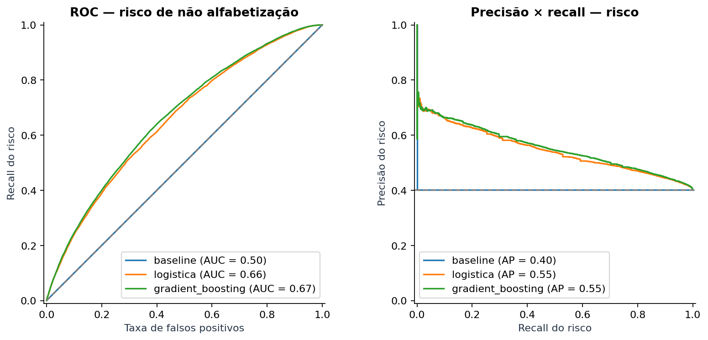
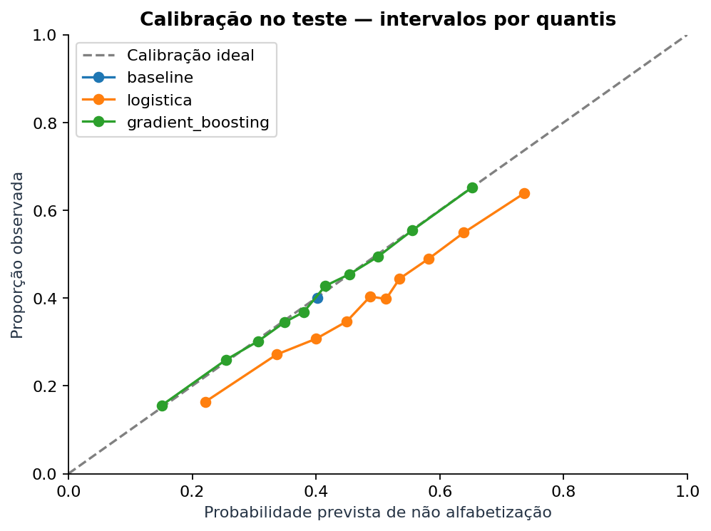
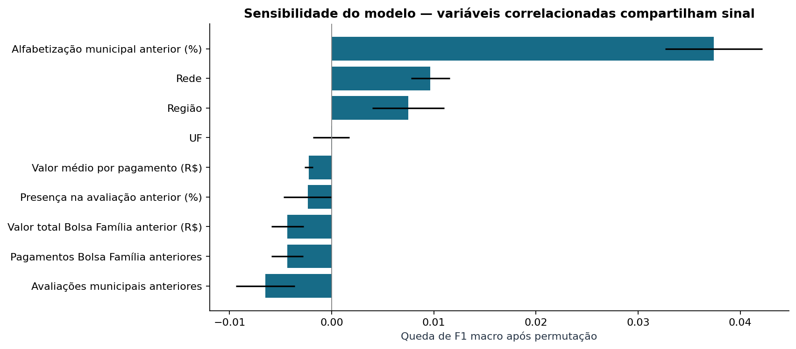
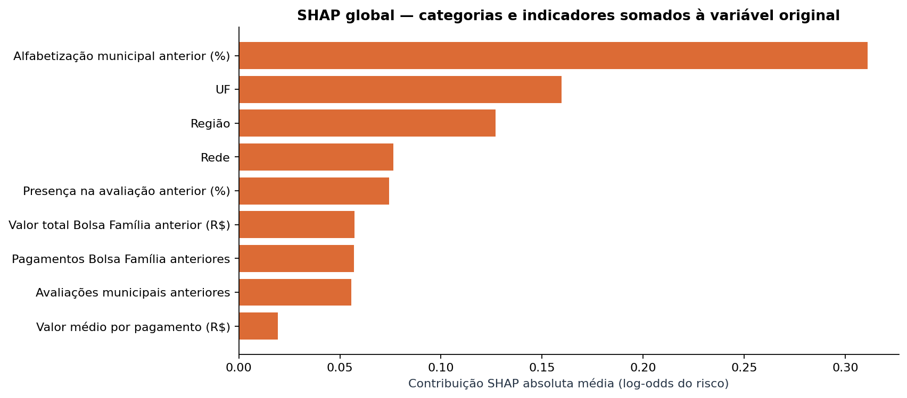

# Tech Challenge FIAP - Fase 3

**Atualização: IBGE, Censo Escolar e teste de 2025.** A Gold enriquecida
agora tem 12 atributos adicionais, totalizando 21 preditores. O experimento
temporal desenvolve em 2024 e reserva 1.966.095 avaliações elegíveis de 2025
para teste. Comece pelo [relatório temporal](reports/resultados_temporais.md)
e pelo [notebook da evolução](notebooks/02_enriquecimento_validacao_temporal.ipynb).
As seções abaixo documentam a referência inicial com nove preditores.

No teste de 2025, a logística enriquecida teve F1 **0,5833**, contra
**0,5839** da referência. A calibração reduziu o Brier para **0,2182**,
com F1 **0,5666** no limiar 0,5. O ganho observado na validação não se
confirmou no teste temporal; previsões operacionais de metas continuam
desabilitadas. Verificação local: 26 testes na Fase 2 e 17 na Fase 3,
além dos comandos completos de enriquecimento e avaliação temporal.

```powershell
python main.py temporal --execution-date 2026-09-08 --ano-treino 2024 --ano-teste 2025
```

Os comandos para construir a nova Gold estão na
[documentação da Fase 2](../fiap-tech-challenge-fase2/docs/enriquecimento_ibge_censo.md).
O comando `tudo` continua reproduzindo o experimento inicial; `temporal`
gera artefatos próprios e preserva o notebook e os resultados anteriores.

**Classificação retrospectiva de alfabetização com dados exclusivamente da Gold
da Fase 2.** Pipeline local: validação, EDA, busca de parâmetros, avaliação por
escola, calibração diagnóstica e interpretabilidade.

Executado com **1.851.852 avaliações válidas de 2024**. A regressão logística,
escolhida na validação, obteve **F1 macro 0,5980 e ROC AUC 0,6567 no teste**.
O [relatório gerado](reports/resultados.md) acompanha a execução mais recente.
O [notebook executado](notebooks/01_analise_alfabetizacao.ipynb) apresenta
a análise em passos, com tabelas e gráficos.

## Contexto do problema

O Indicador Criança Alfabetizada acompanha a alfabetização ao final do 2º ano.
A Fase 2 organizou as fontes educacionais e sociais em um data lake. Aqui
investigamos se território, rede e contexto do ano anterior permitem
distinguir avaliações classificadas como alfabetizadas ou não.

Os atributos são contextuais. Não descrevem trajetória ou família suficientes
para decisões individuais sobre uma criança.

## Objetivo analítico

Alvo `alfabetizado_binario`: **1 = alfabetizado; 0 = não alfabetizado**.
A classe de risco é **0**; probabilidades, recall e precisão do risco seguem
essa orientação. O experimento é retrospectivo: não afirma disponibilidade
das fontes no início de 2024 nem faz previsão de uma safra futura.

## Base utilizada

Fonte única: `gold.base_modelagem_aluno`, execução `2026-09-07`.
Não há importação do código da Fase 2 nem leitura de Silver/Bronze.

| Medida em 2024 | Quantidade |
|---|---:|
| Registros Gold | 2.120.560 |
| Avaliações elegíveis | 1.851.852 |
| Ausentes excluídos do treino | 267.772 |
| Presentes sem proficiência excluídos | 936 |
| Alfabetizados elegíveis | 1.107.119 |
| Não alfabetizados elegíveis | 744.733 |
| UFs | 26 |
| Cobertura do histórico municipal anterior | 76,882% |

Roraima está ausente. Histórico municipal e pagamentos Bolsa Família vêm de
2023. Pagamentos não são beneficiários únicos; presença na avaliação não é
frequência escolar anual.

Nove preditores: rede, UF, região, alfabetização municipal anterior, presença
anterior, quantidade de avaliações municipais anteriores, quantidade e valor
de pagamentos anteriores e valor médio por pagamento. Lista em
[src/config.py](src/config.py).

Metas ficam como contexto, fora do modelo: publicação e revisões anteriores
à previsão não foram comprovadas. Proficiência contemporânea não entra.
Histórico escolar foi excluído: os códigos não são estáveis entre edições.

## Etapas de modelagem

1. Validar a Gold de uma execução/ano e registrar hashes de origem.
2. Separar escolas em aproximadamente 60%/20%/20% para treino/validação/teste.
3. Fazer EDA e formular hipóteses somente no treino.
4. Aprender mediana, indicadores de ausência, log1p de volumes/valores,
   padronização e one-hot dentro de Pipeline/ColumnTransformer em cada dobra.
5. Buscar parâmetros em 149.967 avaliações de escolas inteiras do treino,
   com três dobras StratifiedGroupKFold.
6. Ajustar candidatos em todo o treino e escolher na validação. Congelar a
   escolha, reajustar em treino+validação e avaliar no teste reservado.
7. Gerar métricas, recortes, bootstrap por escola, permutação e SHAP.

| Conjunto | Avaliações | Escolas |
|---|---:|---:|
| Treino | 1.112.203 | 25.396 |
| Validação | 370.443 | 8.466 |
| Teste | 369.206 | 8.466 |

Não há escolas compartilhadas. Municípios podem aparecer dos dois lados.
As proporções referem-se às escolas; o teste não mede generalização temporal
ou para municípios inteiramente novos.
Veja [decisões analíticas](reports/decisoes_analiticas.md).

## Escolha do algoritmo

Candidatos: DummyClassifier prior, regressão logística e HistGradientBoosting.
O baseline prevê a classe majoritária, com probabilidades iguais à prevalência
do desenvolvimento.

Critério pré-declarado: maior F1 macro de validação; diferença favorável ao
boosting de até 0,005 favorece a logística pela simplicidade. Limiar fixo 0,5.
Nesta execução, a logística venceu diretamente. Configuração escolhida:
`C=1`, `class_weight="balanced"`.

O boosting usa `early_stopping=False` para não criar um holdout interno
aleatório por aluno.

## Métricas de avaliação

| Modelo | F1 macro teste | Recall risco | Precisão risco | ROC AUC | Brier |
|---|---:|---:|---:|---:|---:|
| Baseline | 0,3746 | 0,0000 | 0,0000 | 0,5000 | 0,2402 |
| Regressão logística | 0,5980 | 0,6356 | 0,5023 | 0,6567 | 0,2304 |
| Gradient boosting | 0,5884 | 0,3549 | 0,5853 | 0,6661 | 0,2204 |

F1 da logística: IC 95% **[0,5934; 0,6023]**, por bootstrap de escolas com
modelo fixo. Não mede toda a incerteza de fonte, treinamento e seleção.
O boosting tem AUC e Brier melhores; a escolha por F1 de validação foi
preservada, sem trocar o vencedor após ver o teste.



## Interpretação dos resultados

A logística encontra 63,56% dos não alfabetizados, com precisão 50,23%:
sinal contextual moderado. Acurácia isolada seria insuficiente para esse uso.

Os pesos de classe deslocam a calibração. A logística tende a superestimar
risco; seu score pode apoiar ordenação experimental, mas não representa uma
estimativa calibrada da taxa municipal.



Permutação: 5.000 avaliações de teste, cinco repetições. SHAP: 2.000 avaliações,
log-odds da não alfabetização, somando categorias e indicadores de ausência
à variável original. A reconstrução da probabilidade foi validada.
As explicações não orientaram nova seleção de features no mesmo teste.




## Insights encontrados

- Histórico municipal tem a maior queda de F1 quando permutado.
- Rede e região também contribuem; associação não demonstra efeito causal.
- Quantidade e valor de pagamentos são muito correlacionados no treino,
  dificultando separar suas atribuições.
- Algumas importâncias por permutação são negativas nesta amostra; foram
  reportadas e sugerem ablações para outra rodada, sem selecionar pelo teste.
- Classificação no limiar e calibração favorecem modelos diferentes.

## Limitações

Uma edição modelada; cobertura incompleta; ausentes fora do alvo; atributos
predominantemente municipais; ausência de população e infraestrutura; fontes
sem histórico completo de divulgação; medidas não ponderadas e códigos
escolares sem correspondência longitudinal.

Não foram incorporados Censo Escolar, IBGE ou microdados de 2025.
Os modelos e métricas da pasta antiga não foram reutilizados.

## Aplicação prática para políticas públicas

O [ranking territorial](reports/priorizacao_amostra_teste.json) usa o score
médio nas escolas do teste, com pelo menos 100 avaliações e três escolas
por município/rede. Não representa a rede inteira. Metas municipais são
exibidas somente para a rede Municipal; não se calcula distância prevista
da meta com scores sem recalibração.

Uso proposto: investigação e planejamento de apoio com revisão humana.
Não rotular crianças ou reduzir investimento pelo score. Veja
[perguntas estratégicas](reports/aplicacao_estrategica.md) e
[roteiro de vídeo](reports/roteiro_video.md).

## Evoluções futuras

1. Censo Escolar agregado por município/rede/ano e população IBGE na Gold,
   respeitando data de publicação e identidade territorial.
2. Comparar enriquecimento com esta referência sob protocolo pré-definido.
3. Calibrar probabilidades e escolher limiar na validação, conforme orçamento
   de atendimento e custo dos erros.
4. Incorporar outra safra de alunos para teste temporal.
5. Testar novos municípios e ablações de atributos correlacionados sem
   reutilizar o teste para escolher melhorias.

## Executar localmente

Python **3.12**. Na raiz do repositório:

```powershell
python -m venv .venv
.venv\Scripts\Activate.ps1
pip install -r requirements.txt
python -m pytest tests/ -q
python main.py tudo
```

Lake padrão: `../fiap-tech-challenge-fase2/data`.
Para alterar no PowerShell:

```powershell
$env:FASE2_LAKE_PATH = "D:\caminho\fase2\data"
python main.py tudo --ano 2024 --execution-date 2026-09-07
```

Por etapa:

```powershell
python main.py base
python main.py eda
python main.py treinar
python main.py interpretar
python main.py relatorio
```

`--lake`, `--ano` e `--execution-date` selecionam origem em `base`/`tudo`.
Outras etapas usam a base materializada. Treino:
`--max-busca 150000 --dobras 3 --threads 4`.
`--sem-busca` avalia só parâmetros padrão por CV, alterando o experimento.
`--amostra-interpretacao 5000` controla a amostra das explicações.

Somente busca e interpretação usam amostras documentadas; o ajuste final usa
todo o desenvolvimento. Versões, parâmetros, semente e hashes ficam nos
relatórios. Comandos sobrescrevem artefatos correntes; métricas de cada treino
também ficam em `reports/runs/<run_id>/`, fora do Git.

## Organização e entregáveis

```text
data/raw, data/processed  dados locais fora do Git
src/preprocessing        contrato, leitura e divisão
src/modeling             pipelines, busca e treinamento
src/evaluation           métricas, incerteza, SHAP e relatório
src/visualization        EDA e figuras
notebooks                análise guiada
reports                  métricas agregadas, decisões e roteiro
images                   gráficos exportados
modelos                  pipeline serializado local fora do Git
tests                    contratos e invariantes
main.py                  entrada reproduzível
```

A main contém a estrutura inicial; `feat/reconstrucao-fase3-gold` contém
commits por etapa. Nenhum push ou PR foi realizado. O grupo ainda precisa
gravar o vídeo; o roteiro está preparado. Novo clone deve reconstruir base
e modelo, que não são versionados.

## Referências

- Enunciado: `[IAST] - Tech Challenge - Fase 3.pdf`, na pasta superior.
- [Contrato Gold](../fiap-tech-challenge-fase2/docs/base_modelagem_aluno.md).
- [scikit-learn: validação](https://scikit-learn.org/1.7/modules/cross_validation.html).
- [scikit-learn: permutação](https://scikit-learn.org/1.7/modules/permutation_importance.html).
- [SHAP](https://shap.readthedocs.io/en/stable/generated/shap.TreeExplainer.html).
