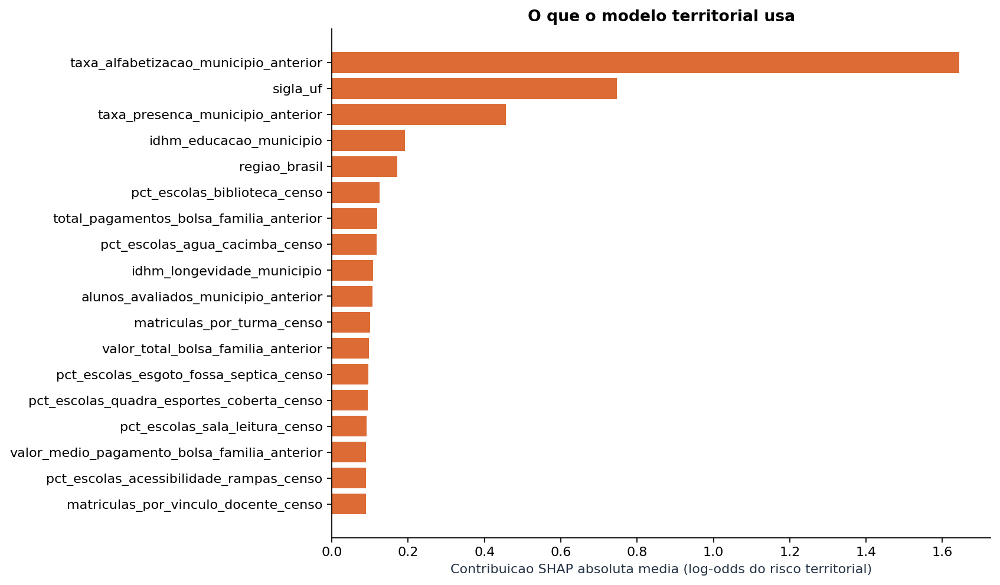
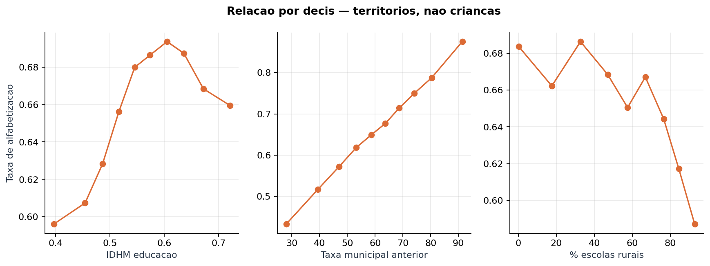

# Diagnóstico de modelagem e insights sobre alfabetização

Execução da Gold enriquecida `2026-09-08`; desenvolvimento em
2024, teste em 2025. Gerado por
`python main.py benchmark`, `python main.py municipal` e `python main.py insights`.
Nenhuma métrica de teste participou de escolha de modelo, limiar ou variável.

## 1. Por que a acurácia por criança não chega a 70%

O contrato enriquecido tem 79 preditores. Todos são medidos em
município (ou município × rede): histórico municipal, Bolsa Família, Censo Escolar
agregado, população e IDHM. Nenhum descreve a criança.

A consequência é mensurável. Em 2024,
**1.851.852 avaliações assumem apenas
6.536 valores distintos de X** — uma combinação por
município × rede. Duas crianças da mesma rede recebem obrigatoriamente a mesma
probabilidade. O tamanho amostral efetivo do modelo não é de 1,8 milhão; é de
6.536.

Isso define um teto que nenhum algoritmo ultrapassa. Um oráculo que soubesse a taxa
verdadeira de cada grupo **no próprio ano de teste** chegaria a:

| Oráculo (limite superior) | Grupos | Acurácia máxima em 2025 |
| --- | ---: | ---: |
| Prever sempre a classe majoritária | — | 0,6626 |
| Saber a taxa exata do **município** no próprio ano | 5.556 | 0,6764 |
| Saber a taxa exata de **município × rede** no próprio ano | 6.574 | 0,6779 |
| Saber a taxa exata da **escola** no próprio ano | 43.538 | 0,7059 |

O teto municipal é de 0,6779 — e só
0,0153
acima de chutar sempre a classe majoritária. Mesmo conhecer a taxa exata de cada
escola daria 0,7059. **Pedir 70% de acurácia
por criança é pedir mais informação do que a base contém.**

### Benchmark de 11 famílias de algoritmos (2024 → 2025)

Busca de hiperparâmetros em validação cruzada por município; seleção congelada antes
de abrir 2025. O limiar de maior acurácia foi escolhido na validação
(`0,49`), nunca no teste.

| Modelo | Acurácia validação 2024 | Acurácia teste 2025 | Acurácia teste (limiar congelado) | F1 macro teste | ROC AUC teste |
| --- | ---: | ---: | ---: | ---: | ---: |
| `baseline_prior` | 0,6117 | 0,6626 | 0,6626 | 0,3985 | 0,5000 |
| `hist_gb_profundo` | 0,6434 | 0,6560 | 0,6552 | 0,5588 | 0,6360 |
| `extra_trees` | 0,6476 | 0,6550 | 0,6535 | 0,5613 | 0,6384 |
| `hist_gb_raso` | 0,6451 | 0,6539 | 0,6511 | 0,5636 | 0,6380 |
| `empilhamento` | 0,6456 | 0,6497 | 0,6484 | 0,5650 | 0,6291 |
| `logistica` | 0,6446 | 0,6480 | 0,6470 | 0,5677 | 0,6266 |
| `xgboost` | 0,6066 | 0,6436 | 0,6426 | 0,5662 | 0,6139 |
| `mlp` | 0,6443 | 0,6382 | 0,6367 | 0,5742 | 0,6338 |
| `random_forest` | 0,6046 | 0,6314 | 0,6234 | 0,5795 | 0,6253 |
| `logistica_balanceada` | 0,5969 | 0,6162 | 0,6152 | 0,5823 | 0,6274 |
| `discriminante_linear` | 0,6443 | 0,6112 | 0,6089 | 0,5852 | 0,6348 |
| `naive_bayes` | 0,5911 | 0,3886 | 0,3886 | 0,3454 | 0,5965 |

**Nenhum dos 11 modelos aprendidos supera a classe majoritária em
acurácia.** O melhor deles, `hist_gb_profundo`, faz 0,6552 contra
0,6626 de não aprender nada — e 9 candidatos se amontoam entre
0,6152 e 0,6552, encostados no teto de informação e não no
algoritmo. (O `naive_bayes` é o único a desabar: sua independência condicional entre
preditores altamente correlacionados não sobrevive à mudança de prevalência entre
edições.) Os modelos ganham do baseline em F1 macro e ROC AUC porque passam a
encontrar não alfabetizados, mas isso custa acurácia.
**Trocar de modelo não resolve; trocar de unidade de análise resolve.**


## 2. Mudando a unidade: classificar territórios, não crianças

**Unidade:** município × rede, com avaliações >= 30 e escolas >= 2.
**Alvo:** `risco_territorial` = 1 quando a taxa de alfabetização do território fica abaixo
da mediana nacional do ano. Classes equilibradas por construção, então a referência
de acaso é 50% — não 66%, como no nível da criança.

Desenvolvimento: 4.433 territórios de
2024 (corte 0,6192), cobrindo
1.773.589 avaliações.
Teste: 4.547 territórios de 2025
(corte 0,7079).

Duas regras de decisão são reportadas. A segunda, **regra de posto**, marca a metade
de menor score: usa só a ordenação prevista e a definição do alvo, e absorve o
deslocamento do nível entre edições — a mediana subiu de
0,6192 para 0,7079
entre 2024 e 2025.

| Modelo | Validação 2024 (posto) | Teste 2025 (posto) | Teste 2025 (limiar 0,5) | ROC AUC teste | Teste sem histórico (posto) |
| --- | ---: | ---: | ---: | ---: | ---: |
| `random_forest` | 0,8179 | 0,7706 | 0,7678 | 0,8467 | 0,7491 |
| `hist_gb_profundo` | 0,8134 | 0,7702 | 0,7671 | 0,8452 | 0,7667 |
| `extra_trees` | 0,8207 | 0,7675 | 0,7631 | 0,8450 | 0,7799 |
| `xgboost` | 0,8207 | 0,7671 | 0,7614 | 0,8412 | 0,7398 |
| `hist_gb_raso` | 0,8152 | 0,7662 | 0,7636 | 0,8420 | 0,7161 |
| `discriminante_linear` | 0,8207 | 0,7636 | 0,7627 | 0,8426 | 0,7205 |
| `empilhamento` | 0,8098 | 0,7618 | 0,7583 | 0,7877 | 0,7636 |
| `mlp` | 0,7862 | 0,7530 | 0,7433 | 0,8127 | 0,7389 |
| `logistica` | 0,8225 | 0,7398 | 0,7337 | 0,8198 | 0,7231 |
| `logistica_balanceada` | 0,8225 | 0,7398 | 0,7332 | 0,8199 | 0,7231 |
| `naive_bayes` | 0,7663 | 0,6743 | 0,6719 | 0,7556 | 0,6642 |
| `baseline_prior` | 0,5127 | 0,4999 | 0,5001 | 0,5000 | 0,4999 |

Sob a regra de posto o F1 macro coincide com a acurácia em todas as linhas
aprendidas: o alvo tem exatamente 50% de positivos e a regra prevê exatamente 50%,
então as duas classes têm os mesmos erros. Por isso a coluna reporta o limiar fixo,
que é onde as duas regras divergem.
O modelo congelado na validação foi **`logistica`**, com acurácia
**0,7398** e ROC AUC 0,8198
no teste de 2025 — 24,0 pontos
percentuais acima do acaso e
acima da meta de 70%. A coluna final repete
o experimento sem as três variáveis de histórico de alfabetização: o contexto estrutural
sozinho sustenta a maior parte do desempenho.

### Recortes do teste

| Dimensão | Grupo | Territórios | Acurácia | ROC AUC |
| --- | --- | ---: | ---: | ---: |
| Rede | Municipal | 4.033 | 0,7424 | 0,8229 |
| Rede | Estadual | 514 | 0,7198 | 0,8029 |
| Região | Nordeste | 1.597 | 0,7689 | 0,8652 |
| Região | Sudeste | 1.289 | 0,6447 | 0,8289 |
| Região | Sul | 922 | 0,7918 | 0,8613 |
| Região | Norte | 424 | 0,8019 | 0,8716 |
| Região | Centro-Oeste | 315 | 0,7460 | 0,8338 |
| Município inédito em 2024 | False | 4.325 | 0,7401 | 0,8209 |
| Município inédito em 2024 | True | 222 | 0,7342 | 0,8066 |


## 3. O que de fato separa territórios com alta e baixa alfabetização

Três leituras independentes sobre a mesma unidade, para não depender de um método só:
contribuição SHAP ao modelo (`xgboost`, reconstrução da probabilidade
validada com erro máximo de 7.2e-07), queda de
acurácia por permutação, e associação direta com a taxa observada.

### 3.1 Peso por pilar temático

| Pilar | Variáveis | Participação no SHAP total |
| --- | ---: | ---: |
| Histórico educacional | 3 | 30,4% |
| Território e rede | 4 | 13,8% |
| Infraestrutura básica | 24 | 13,4% |
| Porte e escala da rede | 9 | 8,2% |
| Recursos humanos na escola | 13 | 8,2% |
| Espaços de aprendizagem | 7 | 8,1% |
| Desenvolvimento humano | 4 | 6,0% |
| Acessibilidade | 8 | 4,4% |
| Transferência de renda | 3 | 4,2% |
| Material pedagógico | 4 | 3,4% |

### 3.2 Variáveis individuais mais usadas pelo modelo

| Variável | Pilar | SHAP absoluto médio (log-odds) |
| --- | --- | ---: |
| `taxa_alfabetizacao_municipio_anterior` | Histórico educacional | 1,644 |
| `sigla_uf` | Território e rede | 0,747 |
| `taxa_presenca_municipio_anterior` | Histórico educacional | 0,456 |
| `idhm_educacao_municipio` | Desenvolvimento humano | 0,192 |
| `regiao_brasil` | Território e rede | 0,171 |
| `pct_escolas_biblioteca_censo` | Espaços de aprendizagem | 0,125 |
| `total_pagamentos_bolsa_familia_anterior` | Transferência de renda | 0,119 |
| `pct_escolas_agua_cacimba_censo` | Infraestrutura básica | 0,118 |
| `idhm_longevidade_municipio` | Desenvolvimento humano | 0,108 |
| `alunos_avaliados_municipio_anterior` | Histórico educacional | 0,107 |
| `matriculas_por_turma_censo` | Porte e escala da rede | 0,100 |
| `valor_total_bolsa_familia_anterior` | Transferência de renda | 0,096 |
| `pct_escolas_esgoto_fossa_septica_censo` | Infraestrutura básica | 0,095 |
| `pct_escolas_quadra_esportes_coberta_censo` | Espaços de aprendizagem | 0,093 |
| `pct_escolas_sala_leitura_censo` | Espaços de aprendizagem | 0,092 |

### 3.3 Queda de acurácia por permutação

| Variável | Pilar | Queda de acurácia | Desvio |
| --- | --- | ---: | ---: |
| `taxa_alfabetizacao_municipio_anterior` | Histórico educacional | 0,1351 | 0,0068 |
| `sigla_uf` | Território e rede | 0,0154 | 0,0044 |
| `taxa_presenca_municipio_anterior` | Histórico educacional | 0,0095 | 0,0021 |
| `total_pagamentos_bolsa_familia_anterior` | Transferência de renda | 0,0011 | 0,0015 |
| `salas_acessiveis_censo` | Infraestrutura básica | 0,0005 | 0,0010 |
| `pct_escolas_internet_comunidade_censo` | Infraestrutura básica | 0,0005 | 0,0004 |
| `pct_escolas_agua_poco_artesiano_censo` | Infraestrutura básica | 0,0003 | 0,0006 |
| `salas_utilizadas_censo` | Porte e escala da rede | 0,0003 | 0,0008 |
| `pct_escolas_internet_aprendizagem_censo` | Infraestrutura básica | 0,0003 | 0,0006 |
| `pct_escolas_com_prof_coordenador_censo` | Recursos humanos na escola | 0,0003 | 0,0005 |
| `pct_escolas_acessibilidade_vao_livre_censo` | Acessibilidade | 0,0002 | 0,0007 |
| `pct_escolas_lab_informatica_censo` | Espaços de aprendizagem | 0,0002 | 0,0009 |

### 3.4 Associação bruta e parcial com a taxa de alfabetização

A coluna **parcial** remove, por resíduos de posto, o IDHM municipal e a população
antes de medir a associação. É a diferença entre "este território é pobre" e "este
território tem tal recurso na escola". Baseada em
8.980 territórios das duas edições.

| Variável | Pilar | Spearman bruto | Spearman parcial | Dif. padronizada (quintil alto − baixo) |
| --- | --- | ---: | ---: | ---: |
| `taxa_alfabetizacao_municipio_anterior` | Histórico educacional | 0,695 | 0,659 | 2,56 |
| `taxa_presenca_municipio_anterior` | Histórico educacional | 0,395 | 0,413 | 1,08 |
| `pct_escolas_quadra_esportes_coberta_censo` | Espaços de aprendizagem | 0,227 | 0,184 | 0,65 |
| `pct_escolas_biblioteca_sala_leitura_censo` | Espaços de aprendizagem | 0,202 | 0,149 | 0,54 |
| `pct_escolas_com_prof_gestao_censo` | Recursos humanos na escola | -0,141 | -0,145 | -0,41 |
| `pct_escolas_com_prof_pedagogia_censo` | Recursos humanos na escola | 0,179 | 0,136 | 0,38 |
| `pct_escolas_quadra_esportes_censo` | Espaços de aprendizagem | 0,191 | 0,135 | 0,55 |
| `pct_escolas_material_ped_jogos_censo` | Material pedagógico | 0,206 | 0,125 | 0,47 |
| `pct_escolas_acessibilidade_rampas_censo` | Acessibilidade | 0,169 | 0,123 | 0,47 |
| `pct_escolas_acessibilidade_corrimao_censo` | Acessibilidade | 0,144 | 0,118 | 0,45 |
| `pct_escolas_internet_censo` | Infraestrutura básica | 0,196 | 0,118 | 0,42 |
| `idhm_renda_municipio` | Desenvolvimento humano | 0,067 | -0,114 | 0,20 |
| `pct_escolas_computador_censo` | Infraestrutura básica | 0,194 | 0,107 | 0,44 |
| `salas_acessiveis_censo` | Infraestrutura básica | 0,014 | 0,107 | -0,14 |
| `pct_escolas_internet_administrativo_censo` | Infraestrutura básica | 0,184 | 0,103 | 0,41 |
| `idhm_educacao_municipio` | Desenvolvimento humano | 0,123 | 0,101 | 0,38 |
| `pct_escolas_agua_potavel_censo` | Infraestrutura básica | 0,167 | 0,100 | 0,30 |
| `pct_escolas_energia_rede_publica_censo` | Infraestrutura básica | 0,154 | 0,095 | 0,29 |
| `pct_escolas_material_ped_infantil_censo` | Material pedagógico | 0,136 | 0,092 | 0,38 |
| `pct_escolas_energia_inexistente_censo` | Infraestrutura básica | -0,143 | -0,085 | -0,23 |

### 3.5 Contrastes categóricos

| Dimensão | Grupo | Territórios | Taxa média | % em risco |
| --- | --- | ---: | ---: | ---: |
| rede | Estadual | 1.030 | 0,6473 | 52,2% |
| rede | Municipal | 7.950 | 0,6573 | 49,7% |
| regiao_brasil | Centro-Oeste | 637 | 0,7281 | 32,0% |
| regiao_brasil | Nordeste | 3.138 | 0,6249 | 58,7% |
| regiao_brasil | Norte | 826 | 0,5673 | 73,1% |
| regiao_brasil | Sudeste | 2.575 | 0,7051 | 36,8% |
| regiao_brasil | Sul | 1.804 | 0,6560 | 49,3% |






## 4. Aplicação: prioridade, perfis e distância da meta

O modelo territorial congelado em `20260912T183839884363Z_municipal` pontua
4.547 territórios de 2025, cobrindo
1.885.374 avaliações. Nenhuma seleção é refeita aqui.

### 4.1 Qualidade do topo da lista

A acurácia global dilui o erro do topo entre milhares de territórios medianos.
O que importa para quem vai agir é a precisão onde se olha primeiro, contra uma
prevalência de referência de 50,0%:

| Corte | Precisão | Ganho sobre o acaso |
| --- | ---: | ---: |
| Top 10 | 80,0% | +30,0 pp |
| Top 25 | 88,0% | +38,0 pp |
| Top 50 | 90,0% | +40,0 pp |
| Top 100 | 95,0% | +45,0 pp |

| Território | Rede | Avaliações | Escolas | Score | Taxa observada | Meta municipal | Abaixo da mediana |
| --- | --- | ---: | ---: | ---: | ---: | ---: | --- |
| Mariana Pimentel/RS | Municipal | 41 | 3 | 1,000 | 0,8049 | — | **não** |
| Porto Alegre/RS | Municipal | 2.677 | 51 | 1,000 | 0,2727 | — | sim |
| Irará/BA | Municipal | 236 | 10 | 0,999 | 0,5720 | — | sim |
| Arataca/BA | Municipal | 74 | 3 | 0,999 | 0,3108 | 0,3222 | sim |
| Iramaia/BA | Municipal | 87 | 3 | 0,999 | 0,4368 | — | sim |
| Gravataí/RS | Municipal | 2.078 | 57 | 0,999 | 0,4620 | 0,6891 | sim |
| Barão do Triunfo/RS | Municipal | 44 | 3 | 0,999 | 0,7273 | 0,1405 | **não** |
| Porto Alegre/RS | Estadual | 4.701 | 176 | 0,999 | 0,3338 | — | sim |
| Capão do Leão/RS | Municipal | 265 | 8 | 0,998 | 0,3434 | 0,5886 | sim |
| Casa Nova/BA | Municipal | 651 | 15 | 0,998 | 0,2396 | 0,2782 | sim |
| Itaju do Colônia/BA | Municipal | 81 | 3 | 0,998 | 0,2469 | 0,3574 | sim |
| Correntina/BA | Municipal | 333 | 11 | 0,998 | 0,5075 | 0,5018 | sim |
| Itanagra/BA | Municipal | 69 | 2 | 0,998 | 0,5507 | — | sim |
| Alvorada/RS | Municipal | 1.568 | 28 | 0,998 | 0,4107 | 0,5739 | sim |
| Taquari/RS | Municipal | 61 | 4 | 0,998 | 0,3934 | 0,5950 | sim |

A taxa observada aparece ao lado do score de propósito. Os erros do topo se
concentram em territórios pequenos, onde a própria taxa observada é instável —
motivo do filtro mínimo de avaliações e escolas.

### 4.2 Perfis de contexto

Somente contexto estrutural numerico, sobre 10 componentes principais; uf, regiao, rede e o resultado observado ficam fora do agrupamento. Critério: maior silhueta entre k de 2 a 6, exigindo grupo minimo de 1%.
Resultado: 2 grupos, silhueta 0,234.

| Perfil | Territórios | IDHM | Rural | Internet | Biblioteca | População mediana | Taxa média | Em risco | Região predominante |
| --- | ---: | ---: | ---: | ---: | ---: | ---: | ---: | ---: | --- |
| Perfil 0 | 2.143 | 0,597 | 70,8% | 86,6% | 32,5% | 16.691 | 0,6791 | 55,0% | Nordeste (66%) |
| Perfil 1 | 2.404 | 0,715 | 25,6% | 99,4% | 77,0% | 21.900 | 0,7140 | 45,5% | Sudeste (45%) |

### 4.3 Distância até a meta municipal

3.927 territórios da rede Municipal têm meta
publicada; 28,3% estão abaixo dela, com distância
mediana de 0,0702. O score ordena esse desfecho com
ROC AUC 0,6394, de forma monótona — o
quintil de maior risco tem 3,2 vezes a chance do de menor risco:

| Faixa de score | Territórios | Abaixo da meta | Distância média | Taxa média |
| --- | ---: | ---: | ---: | ---: |
| Q1 | 786 | 12,6% | 0,1076 | 0,8405 |
| Q2 | 785 | 21,9% | 0,0730 | 0,7752 |
| Q3 | 785 | 32,2% | 0,0564 | 0,7095 |
| Q4 | 785 | 34,4% | 0,0615 | 0,6529 |
| Q5 | 786 | 40,5% | 0,0208 | 0,5529 |

O score ordena quem fica abaixo da meta da própria edição. Não é previsão de meta futura: exigiria comprovar a data de publicação de cada meta e validar o erro fora do tempo.


## 5. Limites

- O alvo e relativo a mediana do proprio ano: mede posicao, nao nivel absoluto.
- Territorios com menos de 30 avaliacoes ou 2 escolas ficam fora; taxas seriam instaveis.
- Associacao entre contexto e alfabetizacao; nenhum coeficiente e efeito causal.
- Municipios aparecem em 2024 e 2025; o recorte 'municipio_novo' isola os ineditos.
- Associacao agregada por territorio; nao vale para individuos (falacia ecologica).
- SHAP e permutacao explicam o modelo, nao o mundo; variaveis correlacionadas dividem credito.
- A parcial controla IDHM e populacao, nao todo o confundimento.
- Censo e IDHM sao do ano anterior e do ultimo levantamento disponivel, respectivamente.
- Score ordena risco; não é estimativa calibrada da taxa do território.
- Prioridade é ponto de partida para diagnóstico local, não corte de recurso.
- Meta municipal vale para a rede Municipal; outras redes ficam fora.
- Agrupamento descreve contexto; não implica política comum.
- Nenhum resultado autoriza classificar uma criança.

## 6. Reprodução

```powershell
python main.py benchmark --execution-date 2026-09-08
python main.py municipal --execution-date 2026-09-08
python main.py insights  --execution-date 2026-09-08
python main.py aplicacao --execution-date 2026-09-08
python main.py relatorio-insights
```

Artefatos: `reports/benchmark_modelos.json`, `reports/modelo_municipal.json`,
`reports/insights_alfabetizacao.json` e as cópias por execução em `reports/runs/`.
