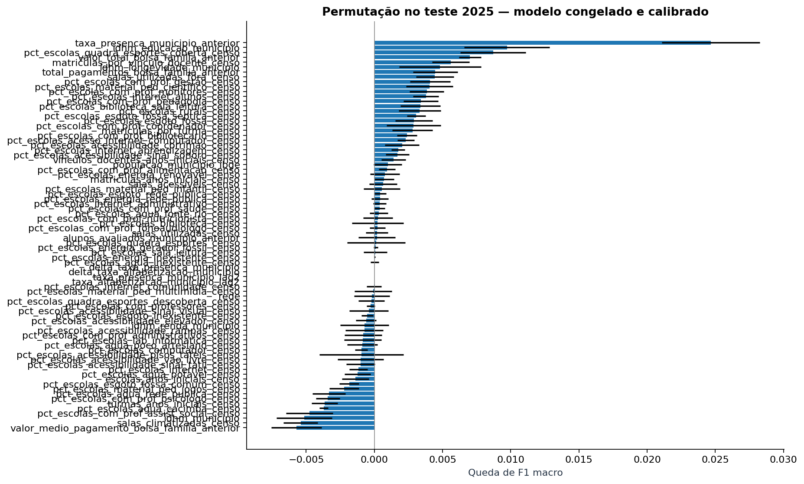

# Gold enriquecida e validação em outra edição

Execução `20260910T013126492250Z_temporal`. Desenvolvimento: **2024**. Teste: **2025**.

**12 novos atributos**, totalizando 80 preditores. Modelo escolhido na validação: **enriquecida_boosting**.

Ajuste e escolha usam somente 2024. A sigmoide é aprendida em escolas de 2024 reservadas para calibração. O modelo é salvo e seu hash registrado antes de carregar o teste de 2025.

## Cobertura da Gold

| Ano | Avaliações | Elegíveis | UFs | IBGE (%) | Censo (%) | Histórico (%) | Bolsa (%) |
|---|---:|---:|---:|---:|---:|---:|---:|
| 2023 | 1747439 | 1502809 | 23 | 100.00 | 100.00 | 0.00 | 0.00 |
| 2024 | 2120560 | 1851852 | 26 | 100.00 | 100.00 | 76.88 | 100.00 |
| 2025 | 2222164 | 1966095 | 27 | 99.99 | 99.99 | 99.26 | 99.99 |

IBGE é integrado por município; Censo por município e rede. Escolas ativas com matrículas nos anos iniciais compõem o contexto. Docentes são vínculos por escola, não pessoas únicas. Percentuais usam respostas válidas; ausência não vira zero.

## Comparação

| Modelo | F1 validação 2024 | F1 teste 2025 | Recall risco | Precisão risco | AUC | Brier |
|---|---:|---:|---:|---:|---:|---:|
| baseline | 0.3733 | 0.3985 | 0.0000 | 0.0000 | 0.5000 | 0.2278 |
| referencia_logistica | 0.5800 | 0.5649 | 0.4323 | 0.4220 | 0.5842 | 0.2372 |
| enriquecida_logistica | 0.5800 | 0.5649 | 0.4323 | 0.4220 | 0.5842 | 0.2372 |
| enriquecida_boosting | 0.5822 | 0.5334 | 0.2092 | 0.4844 | 0.6154 | 0.2169 |
| selecionado_calibrado | — | 0.5371 | 0.2168 | 0.4868 | 0.6154 | 0.2170 |

Comparando logísticas sob o mesmo protocolo, a diferença de F1 no teste com enriquecimento foi **+0.0000**. O sinal pode favorecer ou desfavorecer a inclusão; o teste não é usado para nova escolha.

A calibração é uma transformação predefinida, não um novo candidato escolhido pelo teste. Pode melhorar Brier e reduzir recall/F1 no limiar 0,5; ambos os resultados são apresentados.

## Influência dos atributos

Permutação de 5.000 avaliações do teste, cinco repetições, F1 macro. Diagnóstico final, sem seleção posterior de atributos.

## Limites e metas futuras

- Teste de outra edição; identidades escolares não são longitudinais.
- Datas e versões históricas de publicação não estão integralmente comprovadas.
- Calibração aprendida em 2024 pode se degradar com mudanças em 2025.
- População de 2022 é censo; 2024 é estimativa; não inferir crescimento diretamente.
- Resultados não ponderados por desenho amostral; não estimam indicadores oficiais.
- Não prever metas futuras até validar disponibilidade temporal, agregação e incerteza.

O ranking agregado é diagnóstico das avaliações elegíveis de 2025, sem converter scores em taxas oficiais ou em distância prevista de metas futuras. As métricas por UF, região, rede e municípios novos constam de [resultados_temporais.json](resultados_temporais.json).
